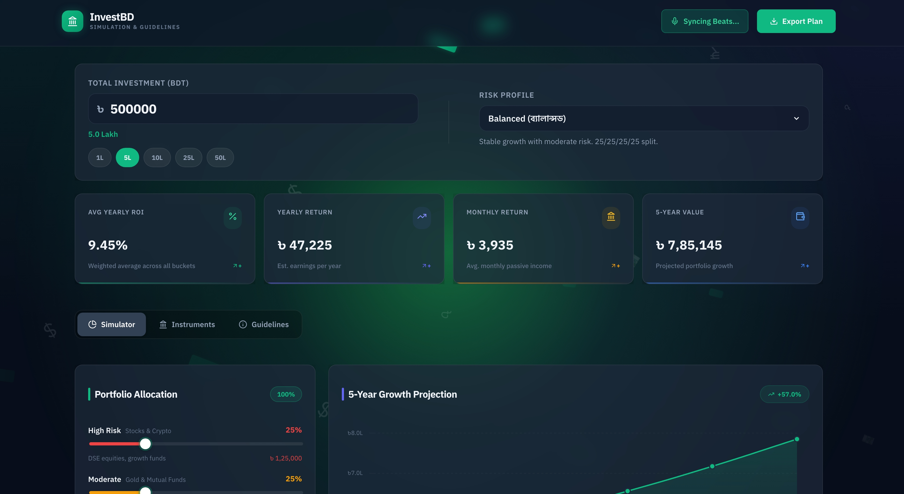

# Bangladesh Investment Planner 🇧 💸

> **Install as a skill:**
> ```bash
> npx skills add https://github.com/MobinMithun/BD_Investment_Planner_SKILL --BD_Investment_Planner_SKILL
> ```

A premium, interactive investment simulator built for Bangladeshi investors. Strategize, compare instruments, calculate ROIs, and visualize long-term financial growth — all in a gorgeous glassmorphic UI.



## ✨ Features

- **Portfolio Health Dashboard** — 5 scored gauges (Diversification, Income Strength, Tax Efficiency, Liquidity, Risk-Adjusted Grade A+→D)
- **Allocation Donut** — CSS conic-gradient ring chart with live legend
- **Bucket Breakdown** — Expandable list-view table showing instruments, returns, and badges per risk bucket
- **Income Timeline** — 5-year passive income projection with monthly/yearly toggle
- **Smart Insights** — Auto-generated tips based on your allocation analysis
- **17 BD Instruments** — Sanchaypatra, FDR, DSE stocks, mutual funds, T-bonds, iFarmer, WeGro, gold, REITs, DPS
- **Tax Rebate Calculator** — FY 2024-25 NBR rules built-in
- **PDF Export** — Download your portfolio plan as a PDF
- **Mic Beat Sync** — Background pulses to ambient music
- **Bilingual UI** — Bengali instrument names alongside English

## 🛠️ Tech Stack

- **React 18** + Vite
- **Chart.js 4** + `react-chartjs-2`
- **jsPDF** + `html2canvas` for PDF export
- **Lucide React** for icons
- **CSS Variables** + glassmorphism design tokens

## 🚀 Quick Start

```bash
npm install
npm run dev     # → http://localhost:5173
npm run build   # Production build in dist/
```

## 📐 Architecture

```
src/
├── App.jsx                     # Root with tab navigation
├── hooks/
│   ├── usePortfolio.js         # State + 5-score engine
│   └── useTaxCalc.js           # Tax rebate computation
├── components/
│   ├── PortfolioScoreCards.jsx # 5 scored gauge cards
│   ├── AllocationDonut.jsx     # CSS donut chart
│   ├── BucketCards.jsx         # List-view bucket table
│   ├── IncomeTimeline.jsx      # Passive income bars
│   ├── PortfolioInsights.jsx   # Auto-generated tips
│   └── ... (12 more)
├── data/
│   ├── instruments.js          # 17 BD instruments
│   ├── profiles.js             # 6 risk profiles
│   └── tax-rules.js            # FY 2024-25 rules
└── styles/
    ├── tokens.css              # Design tokens
    └── components.css          # Component styles
```

## 🧠 Skill

This project is also a **publishable ClawHub skill**. The [`SKILL.md`](./SKILL.md) at the project root contains the full skill definition including:

- System architecture overview
- Data model schemas
- Component quick reference
- Extension guide (add instruments, profiles, scores)
- ROI rates reference table
- Design system documentation

## 📝 License

MIT — built for the Bangladesh investment ecosystem.
